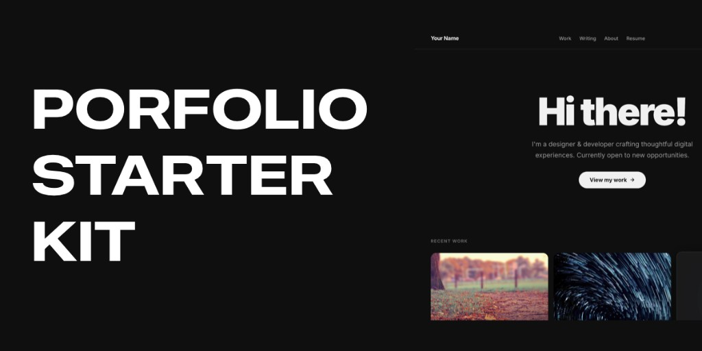
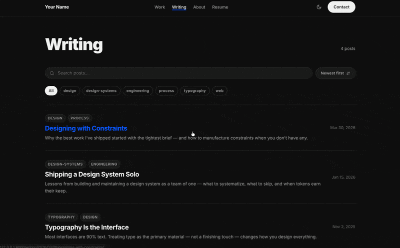
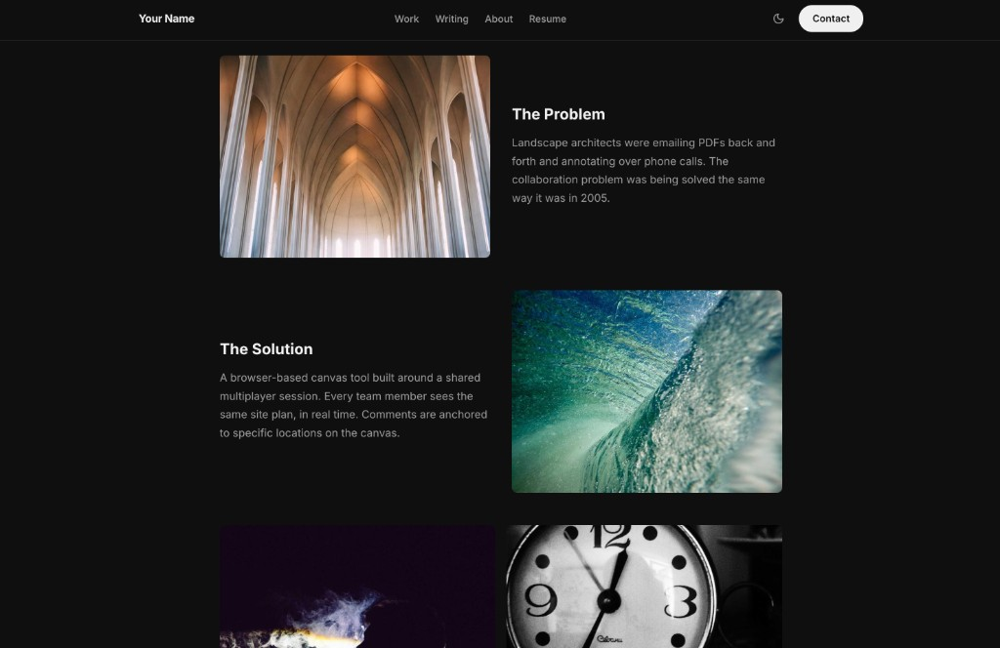
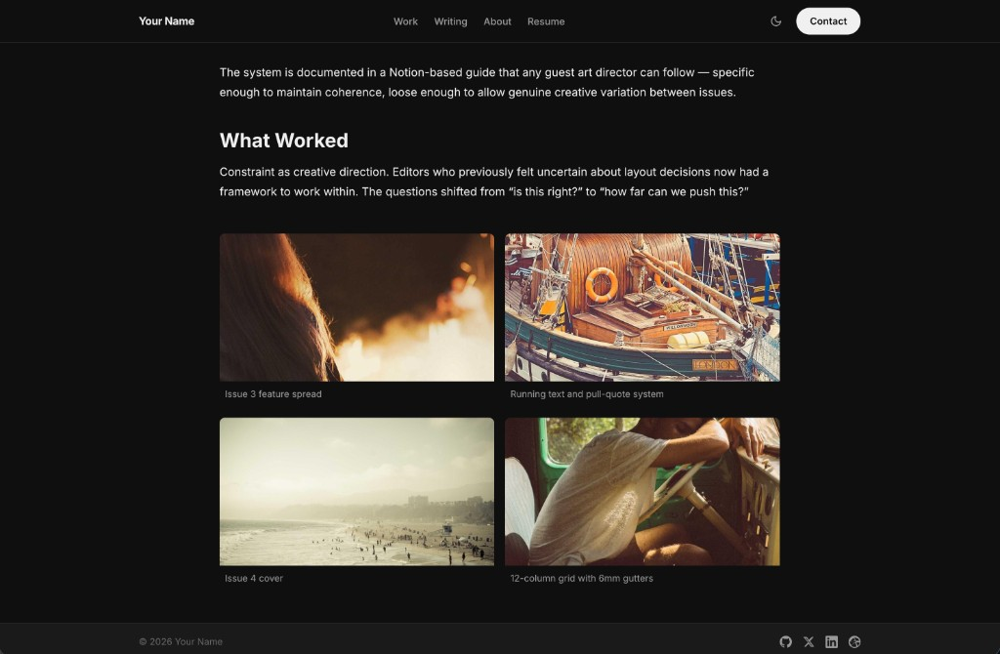
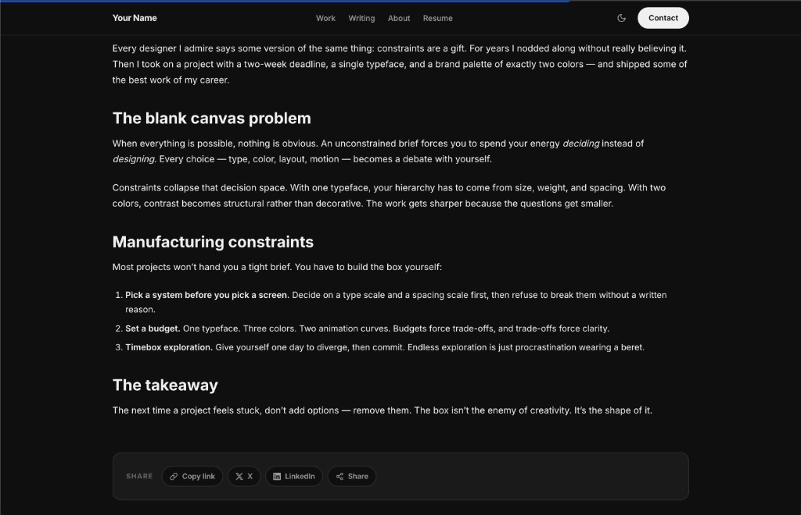
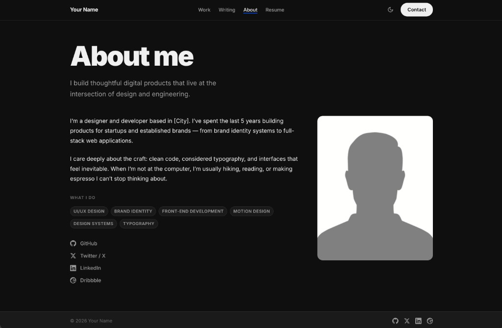

[](https://github.com/patrickpistor/Portfolio-Starter-Kit/stargazers)
[](https://patrickpistor.github.io/Portfolio-Starter-Kit/)
[](https://github.com/patrickpistor/Portfolio-Starter-Kit/actions/workflows/deploy.yml)
[](https://jekyllrb.com)
[](https://www.ruby-lang.org)
[](https://pages.github.com)
[](https://opensource.org/licenses/MIT)

A minimal, customizable portfolio template built with Jekyll. Fork it, fill in your details, and deploy to GitHub Pages in minutes. Write posts on the built-in blog, link to your resume and socials, and showcase your work with three distinct project layouts.

**[Use this template →](https://github.com/patrickpistor/Portfolio-Starter-Kit/generate)** &nbsp;·&nbsp; **[View the live demo →](https://patrickpistor.github.io/Portfolio-Starter-Kit/)**

---

| Homepage | Projects | Writing |
|---|---|---|
|  |  |  |

| Project layout — alternating sections | Project layout — gallery |
|---|---|
|  |  |

| Blog post — share footer | About page |
|---|---|
|  |  |

---

## Features

- **Dark & light mode** — follows OS preference; manual toggle in the nav persists via `localStorage`
- **Built-in blog** — Markdown posts in `_posts/`; the `/writing/` index has tag filtering, newest/oldest sorting, and client-side search
- **Share buttons** — every post gets copy-link, X, LinkedIn, and native device share buttons
- **Projects page** — full project grid at `/work/`; the home page shows a strip of your 3 latest projects, recent writing, and an about teaser
- **Three project layouts** — `project-visual` (full-bleed hero + gallery), `project-text` (editorial, no image), `project-mixed` (cover + alternating sections + gallery)
- **Resume link** — drop a PDF at `assets/resume.pdf` and add it to `nav_links` in `_config.yml`
- **Substack & socials** — add Substack (or any network) to `social_links` in `_config.yml` to show it in the footer and About page
- **Accent color** — set once in `_config.yml`; propagates everywhere via CSS custom properties
- **Four font pairings** — `modern`, `editorial`, `mono`, `classic`; pick one in `_config.yml`
- **GitHub Pages ready** — deploy with the included GitHub Actions workflow

---

## Quick start

You need Ruby 3.x installed (the macOS system Ruby is too old). Install it via [rbenv](https://github.com/rbenv/rbenv) or `brew install ruby`. A `.ruby-version` file is included for rbenv. Then:

```bash
git clone https://github.com/patrickpistor/Portfolio-Starter-Kit.git my-portfolio
cd my-portfolio
bundle install
bundle exec jekyll serve --livereload
```

Open [http://localhost:4000](http://localhost:4000).

---

## Customize in 5 minutes

Almost everything lives in two files.

**`_config.yml`** — your name, bio, accent color, font pairing, nav links, social icons:

```yaml
title: "Your Name"
tagline: "Designer & Developer"
accent_color: "#0052FF"
font_pairing: "modern"   # modern | editorial | mono | classic

nav_links:
  - label: "Work"
    url: "/work/"
  - label: "Writing"
    url: "/writing/"
  - label: "About"
    url: "/about/"
  - label: "Resume"
    url: "/assets/resume.pdf"
```

**`_data/projects.yml`** — the cards on your home page:

```yaml
- title: "My Project"
  category: "Brand & Web"
  description: "Short description shown on the card."
  cover: "/assets/images/project-cover.jpg"   # leave blank for an icon card
  url: "/work/my-project/"
  year: "2024"
```

---

## Adding a project

**1. Add a card** to `_data/projects.yml` (see above). The first entry becomes the full-width hero card.

**2. Create a detail page** at `_projects/my-project.md`:

```markdown
---
layout: project-visual   # project-visual | project-text | project-mixed
title: "My Project"
category: "Brand & Web"
tagline: "Short subtitle."
client: "Client Name"
role: "Design & Development"
year: "2024"
cover: "/assets/images/cover.jpg"
---

Write your project description here in Markdown.
```

The page is automatically available at `/work/my-project/` and listed on the `/work/` grid.

### Layout options

| Layout | Best for |
|--------|----------|
| `project-visual` | Photography, brand campaigns — full-bleed hero + image gallery |
| `project-text` | Writing, research, concepts — large display title, no hero image |
| `project-mixed` | Most projects — cover image, alternating image+prose sections, optional gallery |

---

## Writing a blog post

Add a Markdown file to `_posts/` named `YYYY-MM-DD-slug.md`:

```markdown
---
title: "My Post Title"
date: 2026-06-09
tags: [design, process]
description: "Short summary shown on the index and used for SEO."
cover: "/assets/images/post-cover.jpg"   # optional
---

Write your post in Markdown.
```

The post appears at `/writing/2026/06/09/my-post-title/` and on the `/writing/` index, which supports **searching**, **sorting by date**, and **filtering by tag** — all client-side, no plugins needed. Each post gets share buttons (copy link, X, LinkedIn, and the native device share sheet where supported), a reading-time estimate, a reading progress bar, and related-post suggestions based on shared tags.

Posts are also published to the RSS feed at `/feed.xml` via `jekyll-feed`.

### Substack

Prefer writing on Substack (or want both)? Add it as a social icon in `_config.yml` — it shows up in the footer and on the About page:

```yaml
social_links:
  - label: "Substack"
    url: "https://yourname.substack.com"
    icon: "substack"
```

You can also point the `Writing` nav link at your Substack URL instead of `/writing/` if you'd rather skip the built-in blog entirely.

---

## Deploy to GitHub Pages

1. Push your repo to GitHub.
2. Go to **Settings → Pages**.
3. Under **Source**, select **GitHub Actions**.
4. The included `.github/workflows/deploy.yml` handles the rest on every push to `main`.

**User pages** (`yourusername.github.io`): leave `baseurl: ""` in `_config.yml`.  
**Project pages** (any other repo name): set `baseurl: "/repo-name"` in `_config.yml`.

---

## Project structure

```
.
├── _config.yml          ← site identity, branding, nav, social links
├── _data/
│   └── projects.yml     ← project grid cards (home strip + /work/ page)
├── _layouts/
│   ├── post.html        ← blog post layout (share buttons, related posts)
│   ├── project-visual.html
│   ├── project-text.html
│   └── project-mixed.html
├── _posts/              ← blog posts (YYYY-MM-DD-slug.md)
├── _projects/           ← project detail pages (slug.md)
├── _sass/               ← SCSS partials (_variables, _home, _blog, …)
├── assets/
│   ├── css/main.scss
│   └── images/          ← your images go here
├── about.md
├── index.html           ← home: hero, recent work, recent writing, about
├── work.html            ← full project grid at /work/
├── writing.html         ← blog index at /writing/ (search, sort, filter)
├── Gemfile
└── .github/workflows/deploy.yml
```

---

## Examples

Portfolios built with this template:

| Site | What they customized | Source |
|------|----------------------|--------|
| _Your site here!_ | | |

**Built something with this kit?** We'd love to feature it. Add a row to the table above and open a pull request using the [Add your site](.github/PULL_REQUEST_TEMPLATE/add-example.md) template — append `?template=add-example.md` to your PR URL to load it automatically.

---

## Contributing

Bug reports, feature ideas, and PRs are welcome — see [CONTRIBUTING.md](CONTRIBUTING.md) for development setup and project principles.

---

## License

MIT — use freely for personal or commercial projects.
